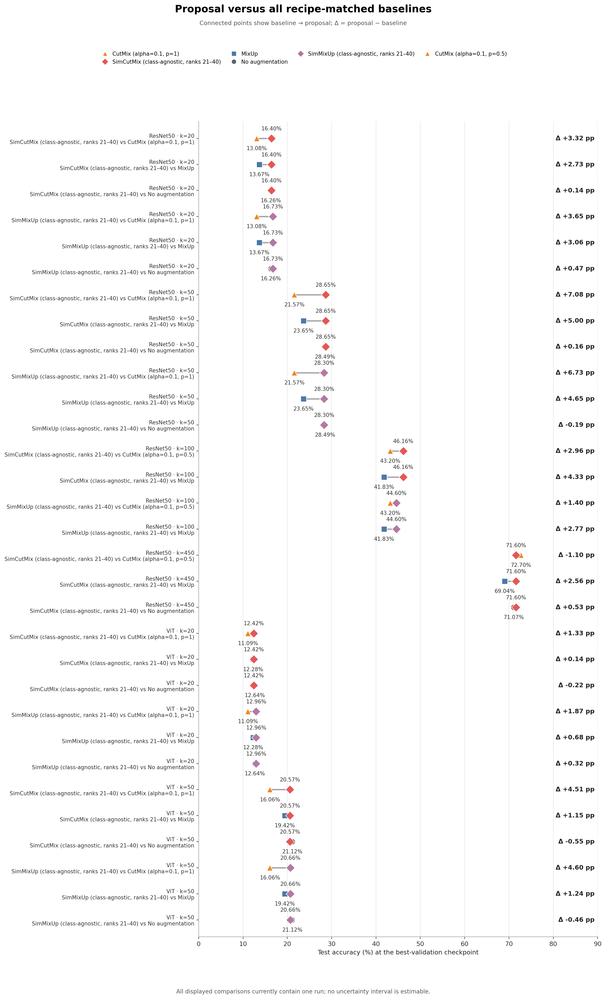
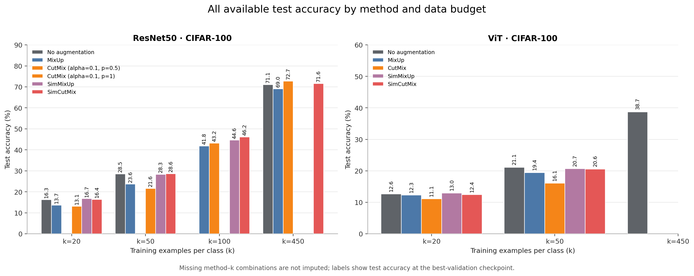
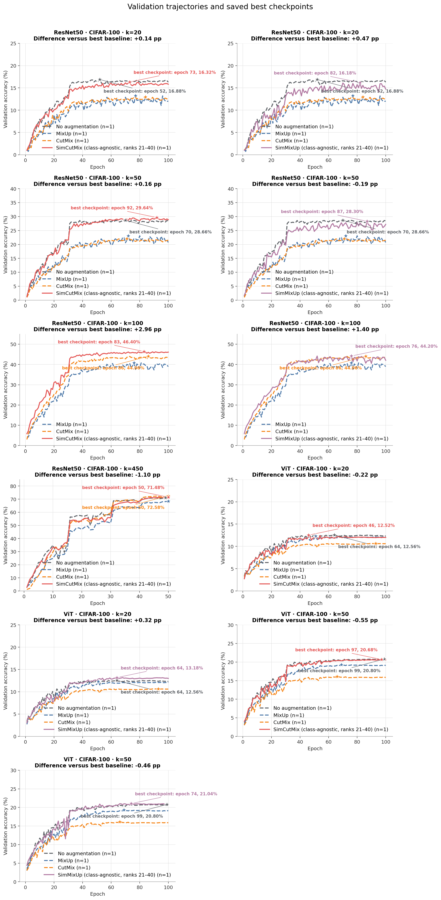

# SRP-Augmentation

SRP-Augmentation is a research codebase for comparing image augmentation
methods in low-data image classification. It supports controlled CIFAR-10 and
CIFAR-100 experiments with reproducible k-shot subsets, CIFAR-adapted ResNet50
and ViT models, standard augmentation baselines, and similarity-guided mixing.

The project is a Student Research Project at the University of Hildesheim.

## At a Glance

**Research question:** Which augmentation strategies improve classification
most reliably when only a small number of labeled examples are available, and
can similarity-guided mixing improve on standard baselines?

**Implemented methods:**

| Family | Methods |
|---|---|
| Standard | None, MixUp, CutMix, AugMix |
| Proposed | SimMixUp, SimCutMix |
| Optional guided strategies | Class-aware, class-agnostic, different-label, anchor-gated, and dynamic neighbor pools |

**Current stage:** The training and guided-pairing pipelines are implemented.
The project is comparing final configurations and still needs multi-seed
validation before making final claims. See
[Project Status](docs/project_status.md) for the current evidence and open
questions.

## Start Here

New collaborators should read these files in order:

1. This README for setup and first commands.
2. [Architecture](docs/architecture.md) for the data and training flow.
3. [Reproducibility](docs/reproducibility.md) before running experiments.
4. [Project Status](docs/project_status.md) for current results and known gaps.
5. [Current Results Summary](notes/current_results_summary.md) for the
   detailed scientific narrative.

The original project proposal is available at
[`docs/Proposal_SRP.pdf`](docs/Proposal_SRP.pdf).

## Current Visual Evidence

The figures below are generated from the tracked experiment summaries and
epoch metrics by `src/graphs/plot_graphs.py`. They are committed so GitHub
always shows the current evidence alongside the underlying records.

### Direct proposal-versus-baseline comparisons

This is the primary result figure: it compares each proposed method with all
available standard baselines under the same recorded training recipe. Missing
baseline runs remain blank. It currently reports single-run comparisons, so it
does not imply statistical significance. Connected points show the baseline to
proposal change, and each displayed Δ is proposal minus baseline in percentage
points.



### Available results across data budgets

This view shows all available active results for both ResNet50 and ViT. Missing
method--k combinations remain blank rather than being estimated, so it also
shows where further matched runs are still needed.



### Validation trajectories for direct comparisons

The validation curves show each proposal together with all available matched
baseline trajectories and mark the best-validation checkpoints used for the
corresponding test measurements.



The [coverage matrix](docs/figures/experiment_coverage.png) provides the
complete experiment-status view, including missing cells and run counts.

## Repository Structure

```text
SRP-Augmentation/
├── data/
│   ├── raw/                    # Local CIFAR downloads; ignored by Git
│   └── splits/                 # Committed validation and k-shot indices
├── docs/
│   ├── architecture.md         # System and experiment flow
│   ├── figures/                # Versioned figures displayed on GitHub
│   ├── project_status.md       # Current stage, evidence, and gaps
│   ├── reproducibility.md      # Reproduction checklist and limitations
│   └── Proposal_SRP.pdf        # Original research proposal
├── notebooks/                  # Exploratory and visual validation notebooks
├── notes/
│   └── current_results_summary.md
├── results/
│   └── experiments/            # Canonical run records and shared artifacts
├── src/
│   ├── augmentations/          # MixUp, CutMix, AugMix, SimMixUp, SimCutMix
│   ├── data/                   # Split generation and indexed datasets
│   ├── experiments/            # Manifest generation
│   ├── graphs/                 # Result plotting
│   ├── models/                 # CIFAR ResNet50 and ViT
│   ├── proposal/               # Embeddings, neighbors, inspection, scoring
│   └── train.py                # Unified experiment entry point
├── tests/                      # Unit and small integration tests
├── requirements.txt
└── README.md
```

`src/proposal/` is the implementation area for the proposed
similarity-guided method. It is not an abandoned prototype.

## Setup

Run commands from the repository root.

### 1. Create and activate a virtual environment

```powershell
python -m venv .venv
.\.venv\Scripts\Activate.ps1
```

### 2. Install dependencies

```powershell
python -m pip install --upgrade pip
python -m pip install -r requirements.txt
```

The current requirements select CUDA 12.8 builds of PyTorch and TorchVision.
They are an installation specification rather than a fully locked research
environment. Read [Reproducibility](docs/reproducibility.md) before producing
results intended for the final report.

### 3. Run the tests

```powershell
python -m unittest discover -s tests -v
```

The test suite does not download CIFAR or launch a full training run.

## Data Splits

The committed files under `data/splits/` are the authoritative experiment
subsets. They contain original CIFAR training-set indices, not image data.

Each dataset has:

- one fixed validation split;
- k-shot training subsets for seeds 0, 1, and 2;
- one maximum post-validation training subset at seed 0.

For CIFAR-100, the maximum setting is `k=450`: 450 training images and 50
validation images per class.

Existing experiments should use the committed splits. To intentionally
regenerate the full split collection:

```powershell
python src\data\make_splits.py
```

TorchVision downloads missing CIFAR data into `data/raw/`. That directory is
ignored by Git.

## Run a Standard Experiment

The unified entry point is `src/train.py`. This example runs a CIFAR-100
ResNet50 CutMix experiment:

```powershell
python -u src\train.py --dataset cifar100 --model resnet50 --k 20 --subset-seed 0 --train-seed 0 --augmentation cutmix --cutmix-prob 0.5 --epochs 100 --batch-size 128 --optimizer sgd --lr 0.1 --momentum 0.9 --nesterov --weight-decay 0.0005 --lr-milestones 30 60 80 --lr-gamma 0.2 --num-workers 2
```

Supported datasets:

- `cifar10`
- `cifar100`

Supported models:

- `resnet50`
- `vit`

Supported augmentations:

- `none`
- `mixup`
- `cutmix`
- `augmix`
- `simmixup`
- `simcutmix`

Every training method starts with random crop and horizontal flip. Therefore,
`--augmentation none` means no additional mixing method; spatial augmentation
is still active.

Use `python src\train.py --help` for the complete option list.

## Run a Similarity-Guided Experiment

SimMixUp and SimCutMix select partners from precomputed nearest-neighbor sets.
The minimum workflow has three stages.

### 1. Compute embeddings

```powershell
python -u src\proposal\compute_embeddings.py --dataset cifar100 --k 20 --subset-seed 0 --encoder resnet50_imagenet --batch-size 64 --num-workers 2 --device auto
```

### 2. Build and inspect neighbors

```powershell
python -u src\proposal\build_neighbors.py --dataset cifar100 --k 20 --subset-seed 0 --encoder resnet50_imagenet --mode class_agnostic --max-neighbors 40 --query-batch-size 512 --device auto
python -u src\proposal\inspect_neighbors.py --dataset cifar100 --k 20 --subset-seed 0 --encoder resnet50_imagenet --mode class_agnostic --max-neighbors 40
```

Neighbor search is exact and blockwise. Reducing `--query-batch-size` lowers
memory use without changing the neighbor result.

### 3. Train with the neighbor file

```powershell
python -u src\train.py --dataset cifar100 --model resnet50 --k 20 --subset-seed 0 --train-seed 0 --augmentation simcutmix --mixup-alpha 1 --epochs 50 --batch-size 64 --optimizer sgd --lr 0.1 --momentum 0.9 --nesterov --weight-decay 0.0005 --lr-milestones 15 30 40 --lr-gamma 0.2 --num-workers 2 --neighbor-path "results\experiments\shared\neighbors\cifar100\k20_seed0\neighbors_class_agnostic_K40.pt" --guided-mode class_agnostic --neighbor-k 20 --neighbor-rank-start 21 --pair-sampling uniform --mix-prob 1 --mix-warmup-epochs 0
```

Here, the saved K40 neighbor set is filtered to ranks 21–40 for training.
Class-aware, different-label, anchor-gated, and dynamic-pool variants use the
same pipeline with different CLI settings. See
[Architecture](docs/architecture.md) for their roles.

## Outputs and Results

New runs are written below:

```text
results/experiments/<dataset>/<model>/k<k>/<method>/
  [<guided-mode>_k<saved-neighbors>_r<rank-window>/]
  e<epochs>_s<subset-seed>_t<train-seed>_c<config-id>/
```

The eight-character config ID prevents two runs with different hidden recipe
settings from overwriting one another. Full optimizer, schedule, and
augmentation settings remain readable in `summary.json`.

Each completed run contains:

| File | Purpose |
|---|---|
| `metrics.csv` | Per-epoch training and validation metrics. |
| `summary.json` | Configuration, best validation epoch, and test evaluation. |
| `checkpoint_best.pt` | Best-validation checkpoint; local and ignored by Git. |

Earlier ResNet50 runs without the current learning-rate schedule are stored in
the external sibling archive
`../SRP-old_experiments/historical_no_lr_schedule/` and are not indexed as
active results.

The central folder documentation and sortable index are:

- [Experiment Folder Guide](results/experiments/README.md)
- [Experiment Manifest](results/experiments/manifest.csv)

After adding or moving canonical run summaries, regenerate the manifest:

```powershell
python src\experiments\build_manifest.py
```

Audit summary/metrics pairs, recorded artifact paths, local `.pt` payloads, and
checkpoint retention candidates with:

```powershell
python src\experiments\audit_artifacts.py --details
```

The audit is read-only unless an explicit `--json-output` path is supplied. It
never moves or deletes artifacts.

Large `.pt` files and raw data are not committed. The curated figures in
`docs/figures/` are versioned so GitHub can display the current experiment
evidence; other PNG outputs remain ignored. A fresh clone can inspect the
tracked metrics and summaries, but guided runs must regenerate or obtain their
neighbor payloads.

## Plotting

Generate the standard comparison figures from saved summaries and metrics:

```powershell
python src\graphs\plot_graphs.py
```

The plotting suite writes four views to `docs/figures/` by default. These
curated figures are versioned and displayed in this README:

- matched proposal-versus-baseline test accuracy;
- validation curves for those matched comparisons;
- all available active test results, without filling missing cells; and
- a coverage matrix with the run count in every method/k cell.

Single runs are shown without uncertainty bars. Sample-standard-deviation bars
and bands appear automatically once repeated runs are available. Stars and
annotations on the validation curves mark the best-validation epochs whose
saved checkpoints were evaluated on the test set. Use `--output-dir` to write
temporary local figures somewhere else without changing the versioned
publication figures.

## Current Limitations

- Most reported experiments still use a single subset seed and training seed.
- Two active ViT AugMix summaries reference checkpoints that are not available
  locally; their tracked metrics and summaries are complete.
- The environment is not yet captured by an exact lock file or inside run
  summaries.
- Current result discrepancies and research tasks are listed in
  [Project Status](docs/project_status.md).

## Documentation Ownership

To prevent status information from diverging:

- `README.md` owns setup, entry points, and first-run instructions.
- `docs/architecture.md` owns the system and data-flow explanation.
- `docs/reproducibility.md` owns reproduction requirements and limitations.
- `docs/project_status.md` owns current work, known gaps, and next tasks.
- `notes/current_results_summary.md` owns detailed result interpretation.
- `results/experiments/README.md` owns the experiment-folder conventions.
- `results/experiments/manifest.csv` is a generated run index, not a narrative
  source of truth.
