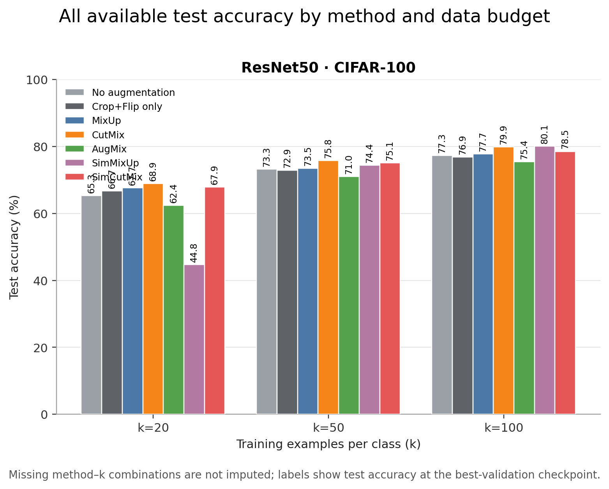
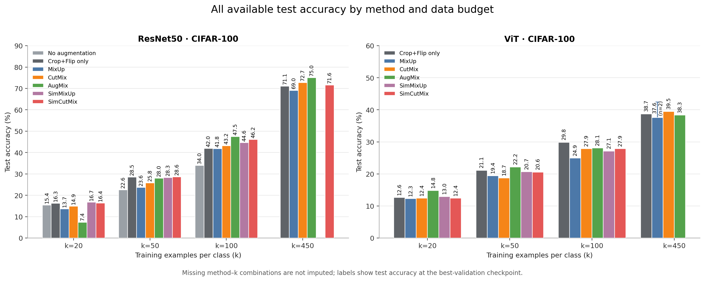

# SRP-Augmentation

SRP-Augmentation is a research codebase for evaluating image augmentation in
low-data image classification. It provides reproducible CIFAR-10/CIFAR-100
k-shot splits, ResNet50 and ViT classifiers, standard augmentation baselines,
and similarity-guided variants of MixUp and CutMix.

The project is a Student Research Project at the University of Hildesheim.

## Research Question

Which augmentation strategies improve classification most reliably when only
a small number of labeled examples are available, and can selecting mixing
partners by visual similarity improve on standard random pairing?

| Family | Methods |
|---|---|
| Reference baselines | Raw; crop + horizontal flip (`none`) |
| Standard augmentation | MixUp, CutMix, AugMix |
| Proposed augmentation | SimMixUp, SimCutMix |

The current comparison study uses CIFAR-100. All available results are
single-run observations with subset seed 0 and training seed 0; they are not
statistical estimates. See [Project Status](docs/project_status.md) for the
verified evidence inventory and open work.

## Documentation

Start with the [documentation index](docs/README.md). The main guides are:

1. [Architecture](docs/architecture.md) - components and data flow.
2. [Reproducibility](docs/reproducibility.md) - setup, commands, and artifact
   requirements.
3. [ISMLL cluster workflow](docs/cluster_workflow.md) - GitHub synchronization,
   Slurm execution, and artifact handling.
4. [ResNet50 comparison protocol](docs/resnet_comparison_v1.md) - the fixed
   comparison recipe and run matrix.
5. [Project status](docs/project_status.md) - current evidence, limitations,
   and next tasks.

The [original proposal](docs/Proposal_SRP.pdf) is retained as a historical
project artifact. It describes the March 2026 plan, not the current state.

## Repository Structure

```text
SRP-Augmentation/
|-- data/
|   |-- raw/                         # Local CIFAR downloads; ignored by Git
|   `-- splits/                      # Committed validation and k-shot indices
|-- docs/
|   |-- figures/{scratch,pretrained}/
|   |-- architecture.md
|   |-- project_status.md
|   |-- reproducibility.md
|   `-- resnet_comparison_v1.md
|-- notebooks/                       # Split and guided-pair inspection
|-- results/comparison_v1/           # Current comparison records
|-- scripts/run_resnet_comparison.ps1
|-- scripts/run_resnet_comparison.slurm
|-- src/
|   |-- augmentations/
|   |-- data/
|   |-- experiments/
|   |-- graphs/
|   |-- models/
|   |-- proposal/
|   `-- train.py
`-- tests/
```

## Setup

Run commands from the repository root in PowerShell.

```powershell
python -m venv .venv
.\.venv\Scripts\Activate.ps1
python -m pip install --upgrade pip
python -m pip install -r requirements.txt
python -m unittest discover -s tests -v
```

`requirements.txt` selects CUDA 12.8 builds of PyTorch and TorchVision. It is
an installation specification, not a fully locked environment. Read
[Reproducibility](docs/reproducibility.md) before producing reportable runs.

## Data Splits

The committed JSON files under `data/splits/` are the authoritative sample
selections. CIFAR-100 has one fixed validation split (50 images per class),
k-shot subsets for k=5/10/20/50/100 with seeds 0/1/2, and a maximum k=450
subset with seed 0. Existing experiments should reuse these files.

To intentionally rebuild the collection:

```powershell
python src\data\make_splits.py
```

Missing CIFAR files are downloaded to the ignored `data/raw/` directory.

## Run the Fixed ResNet50 Comparison

The safest entry point for the active comparison is the PowerShell runner. It
prints the command by default; add `-Execute` to train.

```powershell
.\scripts\run_resnet_comparison.ps1 -Initialization pretrained -K 20 -Method cutmix
.\scripts\run_resnet_comparison.ps1 -Initialization pretrained -K 20 -Method cutmix -Execute
```

Valid initialization values are `scratch` and `pretrained`; valid methods are
`raw`, `none`, `mixup`, `cutmix`, `augmix`, `simmixup`, and `simcutmix`.
ResNet50 uses the standard 224x224 torchvision architecture and ImageNet
normalization in both regimes. `scratch` means random classifier weights;
`pretrained` means ImageNet initialization followed by full fine-tuning.

See [the protocol](docs/resnet_comparison_v1.md) before adding runs. The runner
expects guided neighbor payloads under `results/experiments/shared/neighbors/`,
which are local generated artifacts and are not currently present in this
checkout.

On the ISMLL cluster, submit the Linux/Slurm runner from the repository root:

```bash
sbatch scripts/run_resnet_comparison.slurm pretrained 20 none smoke
sbatch scripts/run_resnet_comparison.slurm pretrained 20 cutmix full
```

Read the [cluster workflow](docs/cluster_workflow.md) before the first run.

## Run a Custom Experiment

`src/train.py` is the unified CLI. This example is a validation-only-safe
starting point for a standard method:

```powershell
python -u src\train.py --dataset cifar100 --model resnet50 --pretrained --k 20 --subset-seed 0 --train-seed 0 --augmentation cutmix --cutmix-alpha 1 --cutmix-prob 0.5 --epochs 100 --batch-size 32 --optimizer sgd --lr 0.01 --momentum 0.9 --nesterov --weight-decay 0.0005 --lr-milestones 30 55 75 --lr-gamma 0.1 --num-workers 2 --skip-test
```

Use `--skip-test` while choosing configurations. Once a configuration is fixed,
rerun without that option to evaluate the best-validation checkpoint on the
test set. Use `python src\train.py --help` for all options.

Augmentation semantics:

- `raw`: deterministic preprocessing only; no crop, flip, or mixing.
- `none`: random crop and horizontal flip; no additional method.
- `mixup`, `cutmix`, and `augmix`: crop + flip plus the selected method.
- `simmixup` and `simcutmix`: crop + flip plus similarity-guided pairing.

## Similarity-Guided Workflow

Guided runs require an offline support pipeline.

```powershell
python -u src\proposal\compute_embeddings.py --dataset cifar100 --k 20 --subset-seed 0 --encoder resnet50_imagenet --batch-size 64 --num-workers 2 --device auto
python -u src\proposal\build_neighbors.py --dataset cifar100 --k 20 --subset-seed 0 --encoder resnet50_imagenet --mode class_agnostic --max-neighbors 40 --query-batch-size 512 --device auto
python -u src\proposal\inspect_neighbors.py --dataset cifar100 --k 20 --subset-seed 0 --encoder resnet50_imagenet --mode class_agnostic --max-neighbors 40
```

Then pass the generated payload with `--neighbor-path`. A saved K40 set can be
restricted to a rank window with `--neighbor-rank-start` and `--neighbor-k`.
See [Reproducibility](docs/reproducibility.md) for a complete example.

## Outputs

`src/train.py` writes one collision-safe directory per scientific
configuration:

```text
<output-root>/<dataset>/<model>/k<k>/<method>/
  [<guided-mode>_k<saved-neighbors>_r<rank-window>/]
  e<epochs>_s<subset-seed>_t<train-seed>_c<config-id>/
    metrics.csv
    summary.json
    checkpoint_best.pt
```

The active study sets `<output-root>` to
`results/comparison_v1/<initialization>`. CSV and JSON records are tracked;
large `.pt` artifacts are generally local.

## Figures

Regenerate both initialization groups with:

```powershell
python src\graphs\plot_graphs.py --experiments-dir results\comparison_v1 --output-dir docs\figures
```

Outputs are separated into `docs/figures/scratch/` and
`docs/figures/pretrained/`. Each group includes `runs.csv`, accuracy views,
validation curves, train-validation gaps, and a coverage matrix. Different
training recipes and historical architectures are not pooled as repeated
seeds.

Current pretrained ResNet50 evidence:



Current scratch-group evidence (including historical imported cohorts):



## Current Limitations

- Every tracked result uses one subset seed and one training seed.
- The pretrained ResNet50 comparison has no k=450 runs.
- Neighbor payloads referenced by guided summaries are not present locally.
- Only 43 of 71 tracked runs currently have their referenced best checkpoint;
  four more checkpoints are in incomplete run folders.
- Environment metadata is not stored in historical summaries.
- Scratch-group records include historical architecture/recipe cohorts and
  must only be compared when the plotting code marks their recipes as matched.
