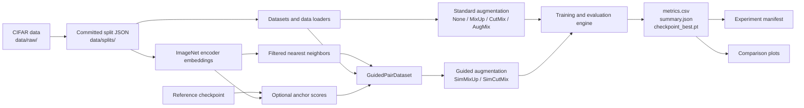

# Architecture

This document explains how SRP-Augmentation fits together. It is intended for a
new collaborator who wants to locate the right code before changing or running
anything.

For setup and first commands, start with the
[project README](../README.md). For experiment reproducibility, see
[reproducibility.md](reproducibility.md).

## Mental Model

The repository has two related experiment paths:

1. **Standard augmentation** trains directly from a committed k-shot split
   using none, MixUp, CutMix, or AugMix.
2. **Similarity-guided augmentation** first computes embeddings and neighbor
   sets, then uses those neighbors to choose the second sample for SimMixUp or
   SimCutMix. Anchor scoring is an optional additional selection step.

Both paths converge on the same training engine and produce the same core
artifacts: epoch metrics, a run summary, and a best-validation checkpoint.



## Source Layout

| Location | Responsibility |
|---|---|
| `src/train.py` | Unified CLI, configuration, data-loader construction, training, evaluation, and output writing. |
| `src/augmentations/` | Standard and similarity-guided augmentation implementations. |
| `src/data/make_splits.py` | Deterministic validation and k-shot split generation. |
| `src/data/indexed_dataset.py` | Dataset wrappers that preserve original CIFAR indices and sample guided pairs. |
| `src/models/` | CIFAR-adapted ResNet50 and ViT builders. |
| `src/proposal/compute_embeddings.py` | Computes ImageNet-encoder embeddings for the selected training subset. |
| `src/proposal/build_neighbors.py` | Builds exact filtered neighbor sets from saved embeddings. |
| `src/proposal/inspect_neighbors.py` | Validates embedding and neighbor payloads. |
| `src/proposal/score_anchors.py` | Combines uncertainty and rarity into optional anchor-selection scores. |
| `src/experiments/build_manifest.py` | Generates the sortable experiment catalog. |
| `src/experiments/audit_artifacts.py` | Audits result pairs, recorded references, and local artifact retention candidates without deleting files. |
| `src/graphs/plot_graphs.py` | Generates comparison figures from summaries and epoch metrics. |
| `tests/` | Unit and small integration tests for splits, datasets, guided methods, and the training recipe. |

`src/proposal/` contains the implementation of the proposed
similarity-guided method. The name refers to the research proposal, not to a
temporary prototype.

## Data and Index Flow

Original CIFAR training-set indices are the stable identifiers that connect
splits, embeddings, neighbors, and anchor scores.

1. `make_splits.py` reserves a fixed validation set and saves the remaining
   k-shot training indices.
2. `compute_embeddings.py` embeds only the selected training indices and saves
   their original indices alongside the tensors.
3. `build_neighbors.py` searches within that saved subset and stores neighbor
   indices and similarity values.
4. `GuidedPairDataset` maps each anchor back to its saved neighbor row and
   returns an anchor/partner pair.
5. `train.py` applies SimMixUp or SimCutMix to the paired batch.

Neighbor modes have different pairing constraints:

| Mode | Partner constraint |
|---|---|
| `class_aware` | Partner has the same class as the anchor. |
| `class_agnostic` | Partner may have the same or a different class. |
| `different_label` | Partner must have a different class. |

The selected neighbor window is defined by `--neighbor-rank-start` and
`--neighbor-k`. For example, start `21` and count `20` samples ranks 21–40.

## Training Flow

`src/train.py` follows this lifecycle:

1. Parse an `ExperimentConfig`.
2. Seed Python, NumPy, PyTorch, transforms, workers, and data-loader shuffling.
3. Load the committed k-shot and validation indices.
4. Build CIFAR datasets, transforms, and data loaders.
5. Build the requested model, optimizer, and learning-rate scheduler.
6. Train and validate for each epoch.
7. Replace `checkpoint_best.pt` whenever validation accuracy improves.
8. Reload that checkpoint and evaluate it once on the test set.
9. Write `metrics.csv` and `summary.json`.

All training modes start with CIFAR random crop and horizontal flip.
Consequently, `--augmentation none` means no additional mixing method; it does
not mean that spatial augmentation is disabled.

## Experiment Artifacts

The current training entry point writes runs below:

```text
results/experiments/
  <dataset>/<model>/k<k>/
    <method>/
      [<guided-mode>_k<saved-neighbors>_r<rank-window>/]
        e<epochs>_s<subset-seed>_t<train-seed>_c<config-id>/
          metrics.csv
          summary.json
          checkpoint_best.pt
```

The short config ID is derived from the complete scientific configuration and
prevents accidental overwrites. The full configuration remains authoritative
in `summary.json`.

Earlier runs without the current learning-rate schedule used the shorter
layout:

```text
results/experiments/<dataset>/<model>/k<k>/<method>/.../
```

Those historical runs are stored in the external sibling archive
`../SRP-old_experiments/historical_no_lr_schedule/` and are not part of the
active manifest. The layouts describe when a run was created; they are not two
different training engines.

Artifact responsibilities are:

| Artifact | Meaning |
|---|---|
| `metrics.csv` | Per-epoch learning rate, loss, and accuracy. |
| `summary.json` | Run configuration, best validation epoch, and final test result. |
| `checkpoint_best.pt` | Model and optimizer state at the best validation epoch. |
| `manifest.csv` | Generated, spreadsheet-friendly index of run summaries. |
| `shared/neighbors/` | Reusable embeddings, neighbor payloads, and their metadata. |
| `shared/anchor_scores/` | Optional anchor-selection score files; created on demand. |
| `shared/figures/` | Generated comparison plots; created on demand. |

CSV and JSON research records are committed when they are part of the project
evidence. Large `.pt` payloads and generated `.png` figures are ignored by Git
and may exist only on the machine that produced them.

## Safe Extension Points

Common additions normally belong in these locations:

- A new standard augmentation: `src/augmentations/`, then connect it in
  `src/train.py`.
- A new model: `src/models/`, then connect its builder in `src/train.py`.
- A new neighbor-filtering strategy: `src/proposal/build_neighbors.py` and the
  guided dataset validation.
- A new experiment summary field: `src/train.py` and, when it should be
  sortable, `src/experiments/build_manifest.py`.
- A new result visualization: `src/graphs/plot_graphs.py`.

Behavioral changes should include or update a test under `tests/` and should
preserve the existing output records unless an intentional migration is being
performed.
