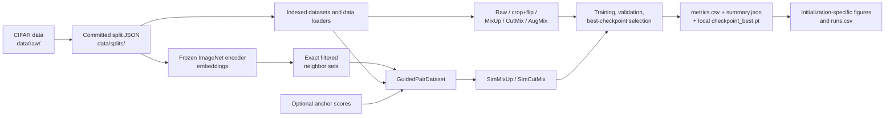

# Architecture

This guide explains how data, support artifacts, training, and result records
fit together. For commands and environment requirements, see
[Reproducibility](reproducibility.md).

## System Overview

The repository supports two training paths:

1. Standard methods load a committed k-shot split and apply `raw`, `none`,
   MixUp, CutMix, or AugMix.
2. Guided methods first compute frozen-encoder embeddings and nearest-neighbor
   sets, then use those sets to choose partners for SimMixUp or SimCutMix.

Both paths use the same training engine and produce the same core records.


```mermaid
flowchart LR
    cifar["CIFAR data\ndata/raw/"] --> splits["Committed split JSON\ndata/splits/"]
    splits --> loader["Indexed datasets and data loaders"]
    splits --> embed["Frozen ImageNet encoder\nembeddings"]
    embed --> neighbors["Exact filtered\nneighbor sets"]
    neighbors --> pairs["GuidedPairDataset"]
    loader --> pairs
    loader --> standard["Raw / crop+flip /\nMixUp / CutMix / AugMix"]
    pairs --> guided["SimMixUp / SimCutMix"]
    scores["Optional anchor scores"] --> pairs
    standard --> train["Training, validation,\nbest-checkpoint selection"]
    guided --> train
    train --> records["metrics.csv + summary.json\n+ local checkpoint_best.pt"]
    records --> plots["Initialization-specific figures\nand runs.csv"]
```

## Source Layout

| Location | Responsibility |
|---|---|
| `src/train.py` | Unified CLI, validation, data loaders, training, evaluation, and record writing |
| `src/augmentations/` | MixUp, CutMix, AugMix, SimMixUp, and SimCutMix implementations |
| `src/data/make_splits.py` | Deterministic validation and k-shot split generation |
| `src/data/indexed_dataset.py` | Original-index preservation and guided partner sampling |
| `src/models/resnet.py` | Standard torchvision ResNet50 at 224x224, random or ImageNet initialization |
| `src/models/vit.py` | Scratch-trained CIFAR ViT at 32x32 |
| `src/proposal/compute_embeddings.py` | Frozen-encoder embedding generation |
| `src/proposal/build_neighbors.py` | Exact, blockwise, filtered neighbor search |
| `src/proposal/inspect_neighbors.py` | Neighbor-payload validation and diagnostics |
| `src/proposal/score_anchors.py` | Optional uncertainty/rarity anchor scores |
| `src/experiments/build_manifest.py` | Generic CSV manifest builder |
| `src/experiments/audit_artifacts.py` | Read-only audit of records and local `.pt` references |
| `src/graphs/plot_graphs.py` | Recipe-aware comparison plots and per-group `runs.csv` files |
| `scripts/run_resnet_comparison.ps1` | Fixed ResNet50 comparison command builder/runner |
| `tests/` | Unit and small integration tests; no full dataset training |

`src/proposal/` is the implementation area for the proposed method; it is not
an abandoned prototype.

## Stable Index Flow

Original CIFAR training-set indices join every stage:

1. `make_splits.py` reserves a fixed validation set and saves training indices.
2. `compute_embeddings.py` embeds only the selected training indices and saves
   those original indices with the embeddings.
3. `build_neighbors.py` searches within that subset and stores neighbor indices
   and similarity scores.
4. `GuidedPairDataset` maps each training anchor to its saved neighbor row.
5. `train.py` applies SimMixUp or SimCutMix to the returned pair.

Neighbor modes:

| Mode | Eligible partner |
|---|---|
| `class_aware` | Same class as the anchor |
| `class_agnostic` | Any class |
| `different_label` | A different class |

`--neighbor-rank-start` is one-indexed and `--neighbor-k` is the number of
ranks used. For example, start 21 with count 20 selects ranks 21-40 from the
saved set.

## Preprocessing and Models

Preprocessing depends on the classifier:

- Current ResNet50 uses the unmodified torchvision architecture, 224x224
  inputs, and ImageNet normalization. It starts randomly unless `--pretrained`
  is passed.
- ViT uses 32x32 CIFAR inputs, 4x4 patches, six transformer blocks, 256 hidden
  dimensions, and eight attention heads. It is trained from scratch.

Some imported scratch-group ResNet50 records were produced by an earlier
CIFAR-adapted 32x32 architecture. Their summaries carry
`cohort=historical_from_scratch`; plotting code keeps incompatible
architecture/recipe cohorts from being treated as repeated runs.

## Augmentation Semantics

| CLI value | Spatial crop/flip | Additional operation |
|---|---:|---|
| `raw` | No | None |
| `none` | Yes | None |
| `mixup` | Yes | Random MixUp |
| `cutmix` | Yes | Random CutMix |
| `augmix` | Yes | AugMix transform chain; no JSD consistency loss |
| `simmixup` | Yes | MixUp with a saved guided partner |
| `simcutmix` | Yes | CutMix with a saved guided partner |

Comparisons among `none` and the four mixing methods share crop+flip.
`raw` answers a different question: what happens without even those spatial
augmentations.

## Training Lifecycle

For a normal training run, `src/train.py`:

1. Parses and validates an `ExperimentConfig`.
2. Seeds Python, NumPy, PyTorch, data-loader generators, workers, and
   transforms.
3. Loads committed split indices and builds datasets/loaders.
4. Builds the classifier, optimizer, and multi-step LR scheduler.
5. Trains and validates each epoch.
6. Replaces `checkpoint_best.pt` whenever validation accuracy improves.
7. Reloads that checkpoint and evaluates the test set unless `--skip-test` was
   requested.
8. Writes `metrics.csv` and `summary.json`.

`--skip-test` supports validation-only configuration selection.
`--evaluate-only` loads the checkpoint for the exact computed configuration,
evaluates clean train/validation/test splits, and updates its summary without
retraining.

## Result Layout

The generic default output root is `results/experiments`, but the active fixed
comparison overrides it with `results/comparison_v1/<initialization>`.

```text
<output-root>/<dataset>/<model>/k<k>/<method>/
  [<guided-mode>_k<saved-neighbors>_r<rank-window>/]
  e<epochs>_s<subset-seed>_t<train-seed>_c<config-id>/
    metrics.csv
    summary.json
    checkpoint_best.pt
```

The eight-character config ID is derived from the scientific configuration
while excluding machine-specific paths and worker count. It prevents distinct
recipes from overwriting one another. `summary.json` remains authoritative.

| Artifact | Role | Tracked? |
|---|---|---:|
| `metrics.csv` | Per-epoch LR, loss, train accuracy, and validation accuracy | Yes |
| `summary.json` | Configuration, best epoch, test result, and artifact paths | Yes |
| `checkpoint_best.pt` | Best-validation model/optimizer state | Usually local |
| `docs/figures/<initialization>/runs.csv` | Generated list of summaries used by plots | Yes |
| Embedding/neighbor `.pt` files | Support data for guided runs | Local/generated |

## Plotting and Comparison Boundaries

`plot_graphs.py` discovers summaries below `results/comparison_v1`, separates
scratch/pretrained/unknown initialization, and writes one figure directory per
group. Direct comparisons require a matched dataset, model, k, subset seed,
training seed, epoch budget, optimizer, LR recipe, preprocessing cohort, and
initialization. Method-specific augmentation parameters remain visible but do
not define the shared training recipe.

This prevents incompatible historical architectures or schedules from being
averaged as if they were repeated seeds. Single runs are displayed without
uncertainty bars.

## Safe Extension Points

- New augmentation: implement under `src/augmentations/`, connect it in
  `src/train.py`, and add focused tests.
- New model: add a builder under `src/models/`, connect preprocessing and CLI
  validation, and test the data shape.
- New neighbor mode: extend `build_neighbors.py`, payload validation, and
  `GuidedPairDataset` tests together.
- New summary field: update `train.py` and any manifest/plot reader that should
  expose it.
- New plot: add it to `src/graphs/plot_graphs.py` and preserve recipe-aware
  grouping.

Do not rewrite existing result records merely to fit a new schema. Add
backward-compatible readers or perform an explicit, documented migration.
